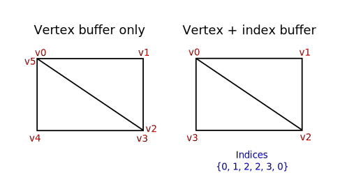
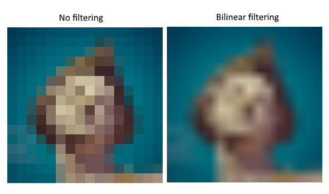
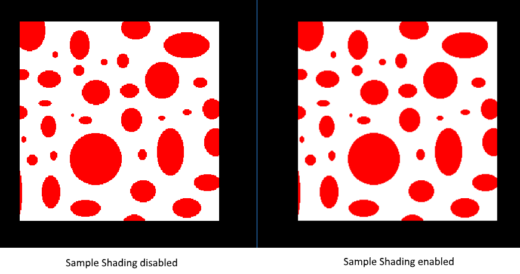
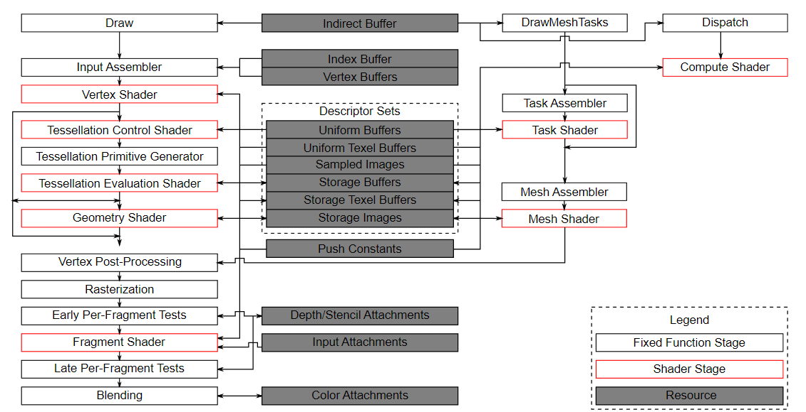

# Introduction to Vulkan Tutorial Notes
- Following Vulkan Tutorial at https://vulkan-tutorial.com/Introduction

- Notes
    - Any section where it's mostly implementation, you can skip and write:
    ```
    Implementation details (skip)
    ```
<br></br>
<br></br>

# Drawing a triangle

## Setup

### Base Code
- General Structure
    - This code includes the necessary headers and defines macros for a Vulkan program. The program is structured as a class with private members for Vulkan objects and functions to initialize them. 
    The main loop is used to render frames. 
    Resources are deallocated in the cleanup function. 
    If a fatal error occurs, a descriptive message is thrown as a std::runtime_error exception, which is caught in the main function and printed. One example of an error is the lack of support for a required extension.
- Resource Management
    - Vulkan objects need to be explicitly destroyed when no longer needed. While C++ offers automatic resource management options, the tutorial chooses explicit allocation and deallocation for better understanding of the API. 
    - After completing the tutorial, one can implement automatic resource management using C++ classes or custom deleters.
    - Vulkan objects are created and allocated using specific functions and destroyed using corresponding functions. The pAllocator parameter, which allows custom memory allocator callbacks, is ignored in the tutorial with a nullptr argument.
- Integrating GLFW
    - GLFW (Graphics Library Framework) is a portable open-source library that provides a simple API for creating and managing windows, handling user input, and managing OpenGL contexts. 
    - In the context of Vulkan, GLFW is commonly used as a utility library to handle window creation and management, input handling, and surface creation for Vulkan rendering applications.

<br></br>


### Instance
- Creating an instance
    - The very first thing you need to do is initialize the Vulkan library by creating an instance. 
    - The VkInstance instance is created by specifying various parameters and options during its creation. 
    - These parameters include application information, such as the application name and version, as well as the required extensions and validation layers.
    - Once the VkInstance is created, it serves as the entry point for interacting with the Vulkan API. 
    - It acts as a handle through which the application can access various Vulkan features and functionalities. The instance is used to create logical devices, manage resources, query device capabilities, and performs other Vulkan operations.
- Encountered VK_ERROR_INCOMPATIBLE_DRIVER
    - VK_ERROR_INCOMPATIBLE_DRIVER is a Vulkan error message indicating that the installed graphics driver on your system is not compatible with the Vulkan API version or does not meet the minimum requirements. 
    - To resolve the issue, you can try updating your graphics driver, ensuring your GPU supports Vulkan, checking for the required Vulkan API version, verifying operating system compatibility, and addressing any system configuration issues. 
- Checking for extension support
    - To check for extension support in Vulkan, you can use the vkEnumerateInstanceExtensionProperties function before creating an instance. This function retrieves a list of supported extensions and stores the details in an array of VkExtensionProperties. 
    - By providing a pointer to a variable, you can obtain the number of extensions available. While essential extensions like the window system interface can be required and checked for error code VK_ERROR_EXTENSION_NOT_PRESENT, optional functionality can be checked using this method.
- Cleaning up
    - The VkInstance should be destroyed only when the program is about to exit. 
    - In the cleanup function, the vkDestroyInstance function is used to destroy the instance. 
    - The function takes the instance as a parameter, and since the allocator callback is optional, nullptr is passed to it. 
    - It's important to clean up all other Vulkan resources created before destroying the instance.

<br></br>


### Validation layers
- What are validation layers?
    - The Vulkan API prioritizes minimal driver overhead, resulting in limited default error checking. Mistakes like incorrect enumerations or null pointers may cause crashes or undefined behavior. 
    - To address this, Vulkan offers optional validation layers. Validation layers are components that intercept Vulkan function calls to perform additional operations:
        1. Checking the values of parameters against the specification to detect misuse.
        2. Tracking creation and destruction of objects to find resource leaks.
        3. Checking thread safety by tracking threads that calls originate from.
        4. Logging every call and its parameters to the standard output.
        5. Tracing Vulkan calls for profiling and replaying.
- Using validation layers
    - Implementation details (skip)
- Message callback
    - The validation layers will print debug messages to the standard output by default, but we can also handle them ourselves by providing an explicit callback in our program. 
    - To set up a callback in the program to handle messages and the associated details, we have to set up a debug messenger with a callback using the VK_EXT_debug_utils extension.
- Debuggin instance creation and destruction
    - In addition to validation layers, Vulkan provides the Debug Utils Messenger extension (VK_EXT_debug_utils), which allows for more detailed debugging and logging capabilities. 
    - The vkCreateDebugUtilsMessengerEXT function is used to create a debug messenger object that receives debugging callbacks for various Vulkan events. This function requires a valid instance to have been created beforehand.
    - During instance destruction, it is necessary to properly clean up the debug messenger object using the vkDestroyDebugUtilsMessengerEXT function. This function takes the instance and the debug messenger object as parameters and ensures that all resources associated with the debug messenger are properly released.
- Testing
    - Implementation details (skip)
- Configuration
    - When working with validation layers in Vulkan, there are additional settings available beyond the flags provided in the VkDebugUtilsMessengerCreateInfoEXT structure. These settings allow for further customization of the behavior of the validation layers.
    - To access and configure these layer settings, you can navigate to the Vulkan SDK installation directory and locate the "Config" directory. Inside this directory, you will find a file named "vk_layer_settings.txt" that provides instructions on how to configure the layers.
    - To configure the layer settings for your specific application, you can copy the "vk_layer_settings.txt" file to the "Debug" and "Release" directories of your project. Then, follow the instructions provided in the file to modify the settings according to your desired behavior.
<br></br>


### Physical devices and queue families
- Selecting a physical device
    - To use Vulkan, you need to select a suitable graphics card, also known as a physical device. 
    - After initializing the Vulkan library with a VkInstance, you can query the available physical devices using vkEnumeratePhysicalDevices. Next, evaluate each device's properties and features to determine its suitability for your application. Choose the best device based on your requirements. 
    - Once selected, you can create a logical device using vkCreateDevice to interact with the chosen physical device.
- Base device suitability checks
    - To evaluate the suitability of a physical device in Vulkan, you can start by querying basic device properties using the vkGetPhysicalDeviceProperties function. 
    - This provides information such as the device name, type, and supported Vulkan version. These details help assess the device's compatibility and capabilities for your application. 
- Queue families
    - In Vulkan, operations are performed by submitting commands to queues, which originate from different queue families. Each queue family supports a specific subset of commands, such as compute or memory transfer operations. 
    - To determine the appropriate queue family for our desired commands, we implement a function called findQueueFamilies. This function queries the available queue family properties, evaluates their capabilities, and selects the queue families that support the required commands. 
    - By identifying the suitable queue families, we ensure efficient execution of operations in Vulkan. Multiple queue families may be needed for concurrent handling of different command types.
<br></br>


### Logical device and queues
- Introduction
    - In Vulkan, after selecting a physical device, the next step is to set up a logical device to interface with it. The process is similar to creating an instance and involves specifying desired features, extensions, and queue configurations. 
    - You can create multiple logical devices from the same physical device to meet varying requirements. 
    - The logical device serves as the communication channel between your application and the physical device, allowing you to execute Vulkan commands and access resources efficiently. 
- Specifying the queues to be created
    - When creating a logical device in Vulkan, you need to specify the queues to be created using the VkDeviceQueueCreateInfo structure. 
    - For a graphics queue, you set the queue family index to the desired queue family that supports graphics capabilities. 
    - Typically, only one queue is needed for graphics operations. The queueCount parameter is set to 1, and the pQueuePriorities parameter can be set to a single value of 1.0f. 
- Specifying used device features
    - The next information to specify is the set of device features that we'll be using. These are the features that we queried support for with vkGetPhysicalDeviceFeatures.
- Creating the logical device
    - To create a logical device in Vulkan, you need to fill in the VkDeviceCreateInfo structure. This structure holds various parameters that define the configuration and features of the logical device. 
    - Key fields to consider include sType, pNext, flags, queueCreateInfoCount, pQueueCreateInfos, enabledLayerCount, ppEnabledLayerNames, enabledExtensionCount, and ppEnabledExtensionNames.
    - Once the structure is filled, you can create the logical device using the vkCreateDevice function. The logical device connects your application to the selected physical device, enabling the execution of Vulkan commands and utilization of device capabilities.
- Retrieving queue handles
    - When creating a logical device in Vulkan, queues are automatically created along with the device. However, to interact with these queues and submit commands, you need to retrieve their handles. 
    - By adding a class member of type VkQueue, you can store a handle to the desired queue, such as a graphics queue. To retrieve the handle, use the vkGetDeviceQueue function, passing in the logical device, the queue family index, and the index within the queue family.
<br></br>


## Presentation

### Window surface
- Window surface creation
    - In Vulkan, to connect with the window system and present rendered images, Window System Integration (WSI) extensions like VK_KHR_surface are used. 
    - This extension exposes a VkSurfaceKHR object representing an abstract surface for image presentation. The surface is backed by the window created using GLFW. 
    - The VK_KHR_surface extension is automatically enabled as part of the required instance extensions returned by glfwGetRequiredInstanceExtensions. The surface creation should be done after instance creation and can influence physical device selection.
- Querying for presentation support
    - In Vulkan, querying for presentation support is necessary to determine if a device can present images to a created surface. 
    - Just because the Vulkan implementation supports window system integration doesn't guarantee that every device can do so. To check, we use the vkGetPhysicalDeviceSurfaceSupportKHR function to check if a queue family can present images. 
    - By finding a suitable queue family, you can create a logical device that supports both the necessary graphics operations and presenting images to the surface.
- Creating the presentation queue 
    - Creating the presentation queue in Vulkan involves modifying the logical device creation procedure to include the presentation queue and creating a member variable to hold the queue handle. 
    - The necessary queue families, such as the graphics and present queue families, are identified, and a set is used to store the unique queue families. 
    - Iterate over the set to create VkDeviceQueueCreateInfo structures for each queue family, specifying the queue family index, queue count (usually one), and queue priority. 
    - When creating the logical device, include the VkDeviceQueueCreateInfo structures along with other device creation parameters.
<br></br>


### Swap chain
- Checking for swap chain support
    - In Vulkan, the concept of a "default framebuffer" is not present. Instead, Vulkan requires the explicit creation of an infrastructure called a swap chain to manage the buffers used for rendering before they are presented on the screen. 
    - The swap chain acts as a queue of images waiting to be displayed. The application acquires an image from the swap chain to render to it and then returns it back to the queue. 
    - The specific behavior of the queue and the conditions for presenting an image depend on the swap chain configuration, but its main purpose is to synchronize the presentation of images with the screen's refresh rate.
    - Before creating a swap chain, it is necessary to check for swap chain support. Not all graphics cards are capable of directly presenting images to a screen, especially those designed for servers that lack display outputs. 
    - Additionally, since image presentation is closely tied to the window system and surfaces associated with windows, it is not part of the core Vulkan functionality. 
    - To use the swap chain, the application needs to enable the VK_KHR_swapchain device extension after verifying its support by querying for its availability.
- Enabling device extensions
    - To enable the VK_KHR_swapchain extension in Vulkan for working with the swap chain, you need to modify the logical device creation structure. 
    - Instead of setting createInfo.enabledExtensionCount to 0, you set it to the number of enabled extensions (in this case, the VK_KHR_swapchain extension). Additionally, createInfo.ppEnabledExtensionNames should be set to an array containing the names of the enabled extensions.
- Querying details of swap chain support
    - When working with Vulkan, it is not enough to simply check if a swap chain is available. There are three main properties that need to be checked before proceeding with swap chain creation:
        1. Basic surface capabilities
            - This includes information such as the minimum and maximum number of images in the swap chain and the minimum and maximum width and height of the images. 
            - These capabilities help determine the appropriate settings for the swap chain to ensure it can function correctly with the window surface.
        2. Surface formats
            - This property refers to the pixel format and color space of the images in the swap chain. Different platforms and systems may support different formats and color spaces. 
            - Querying the available surface formats allows the application to select the most suitable format for rendering and displaying images.
        3. Presentation modes
            - The presentation mode determines how the images in the swap chain are presented to the screen. Different modes may offer different synchronization and display behaviors.
- Choosing the right settings for the swap chain
    - It is crucial to choose the optimal settings for the swap chain. This involves determining the surface format (color depth), presentation mode (conditions for swapping images to the screen), and swap extent (resolution of images in the swap chain). 
    - By querying the available surface formats, presentation modes, and surface capabilities, you can select the most suitable options based on factors such as color depth, desired performance, synchronization, and window system constraints. 
- Creating the swap chain
    - The createSwapChain function is called after logical device creation in the initVulkan function. Within the createSwapChain function, the surface format, presentation mode, swap extent, and other relevant settings are determined. 
    - Finally, the swap chain is created using the vkCreateSwapchainKHR function, ensuring that the swap chain is properly configured for synchronized image presentation with the screen.
- Retrieving the swap chain images
    - To summarize, after creating the swap chain in Vulkan, the next step is to retrieve the handles of the VkImages within the swap chain. This can be done by calling vkGetSwapchainImagesKHR function. 
    - First, query the number of images in the swap chain to resize the container accordingly. Then, call vkGetSwapchainImagesKHR again to retrieve the handles and store them in a vector. These handles will be used for rendering operations. 
    - No explicit cleanup is needed for the swap chain images as they will be automatically cleaned up when the swap chain is destroyed.
<br></br>


### Image views
- In Vulkan, an image view is used to access the data stored in a VkImage object. It acts as a window or view into the image, specifying how to interpret and access the pixels. Creating a VkImageView is necessary to use VkImages in the render pipeline. 
- For the swap chain images, a basic image view is created for each image, allowing them to be used as color targets in rendering operations.
<br></br>


## Graphics Pipeline Basics

### Introduction

1. Input assembler
    - Collects raw vertex data from the buffers you specify and may also use an index buffer to repeat certain elements without having to duplicate the vertex data itself.
2. Vertex shader
    - Run for every vertex and generally applies transformations to turn vertex positions from model space to screen space. It also passes per-vertex data down the pipeline.
3. Tessellation shaders
    - Allows you to subdivide geometry based on certain rules to increase the mesh quality. This is often used to make surfaces like brick walls and staircases look less flat when they are nearby.
4. Geometry shader
    - Run on every primitive (triangle, line, point) and can discard it or output more primitives than the amount that came in.
5. Rasterization stage
    - Discretizes the primitives into fragments. These are the pixel elements that they fill on the framebuffer. 
    - Any fragments that fall outside the screen are discarded and the attributes outputted by the vertex shader are interpolated across the fragments.
    - Usually fragments that are behind other primitive fragments are also discarded here because of depth testing.
6. Fragment shader
    - Invoked for every fragment that survives and determines which framebuffer(s) the fragments are written to and with which color and depth values.
    - It can do this using the interpolated data from the vertex shader, which can include things like texture coordinates and normals for lighting.
7. Color blending
    - Applies operations to mix different fragments that map to the same pixel in the framebuffer.
    - Fragments can simply overwrite each other, add up or be mixed based upon transparency.
<br></br>

- Difference between fixed-function and programmable stages.
    - Stages with a green color are fixed-function stages. These stages allow you to tweak their operations using parameters, but the way they work is predefined.
    - Stages with an orange color on the other hand are programmable, meaning that you can upload your own code to the graphics card to apply exactly the operations you want.
        - This allows you to use fragment shaders, for example, to implement anything from texturing and lighting to ray tracers. These programs run on many GPU cores simultaneously to process many objects, like vertices and fragments in parallel.
<br></br>


### Shader modules
- Introduction
    - In Vulkan, shader code needs to be specified in a bytecode format called SPIR-V, unlike earlier APIs that used human-readable syntax like GLSL and HLSL. 
    - SPIR-V is designed to be used with Vulkan and OpenCL and offers advantages such as simplified compiler implementation and improved compatibility across different GPU vendors. 
    - Khronos provides a vendor-independent compiler that translates GLSL code to SPIR-V, ensuring compliance with the standard. Google's glslc.exe can also be used for this purpose and provides additional features. 
    - GLSL itself is a shading language with a C-style syntax, featuring global variables for input and output handling, built-in vector and matrix primitives, and functions for graphics programming operations.
- Vertex shader
    - The vertex shader in Vulkan processes individual vertices, taking attributes like position, color, normal, and texture coordinates as input. 
    - It calculates the final position in clip coordinates and determines the attributes to be passed on to the fragment shader, such as color and texture coordinates. These values are then interpolated by the rasterizer to create a smooth gradient across the fragments.
    - Clip coordinates are four-dimensional vectors generated by the vertex shader. These coordinates are transformed into normalized device coordinates by dividing the vector by its last component. 
    - Normalized device coordinates are homogeneous coordinates that map the framebuffer to a coordinate system ranging from -1 to 1 in both dimensions. Additionally, the Z coordinate now ranges from 0 to 1.

- Fragment shader
    - The triangle that is formed by the positions from the vertex shader fills an area on the screen with fragments. The fragment shader is invoked on these fragments to produce a color and depth for the framebuffer (or framebuffers).
- Per-vertex colors
    - Implementation details (skip)
- Compiling the shaders
    - In Vulkan, to compile shaders, you need to create a "shaders" directory in your project's root directory. Inside this directory, you store the vertex shader in a file called "shader.vert" and the fragment shader in a file called "shader.frag".
- Loading a shader
    - In Vulkan, after compiling shaders into SPIR-V bytecode, they need to be loaded into the program for use in the graphics pipeline. 
    - To simplify this process, a helper function can be implemented to load the binary data from the shader files. This function reads the contents of the shader files, retrieves the binary data, and stores it in a suitable data structure.
- Creating shader modules
    - In Vulkan, shader code needs to be wrapped in a VkShaderModule object before it can be used in the graphics pipeline.
    - This shader module can be utilized when defining the shader stages in the graphics pipeline setup.
- Shader stage creation
    - In Vulkan, shaders are assigned to specific pipeline stages using VkPipelineShaderStageCreateInfo structures during the creation of the graphics pipeline. These structures contain information about the shader stage type, shader module, entry point function name, and specialization data.
    - To assign the vertex shader, the VkPipelineShaderStageCreateInfo structure is filled with the appropriate stage type (VK_SHADER_STAGE_VERTEX_BIT), the VkShaderModule object containing the shader code.
<br></br>


### Fixed functions
- Dynamic state
    - Dynamic state allows for certain properties in a graphics pipeline to be changed during drawing without recreating the entire pipeline. Examples include viewport size, line width, and blend constants. 
    To utilize dynamic state, a VkPipelineDynamicStateCreateInfo structure is used. This approach provides more flexibility and is commonly used for properties like viewport and scissor state, simplifying the pipeline setup.
- Vertex input
    - The VkPipelineVertexInputStateCreateInfo structure describes the format of the vertex data that will be passed to the vertex shader. It describes this in roughly two ways:
        - Bindings: spacing between data and whether the data is per-vertex or per-instance (see instancing).
        - Attribute descriptions: type of the attributes passed to the vertex shader, which binding to load them from and at which offset.
- Input Assembly
    - The VkPipelineInputAssemblyStateCreateInfo struct describes two things: what kind of geometry will be drawn from the vertices and if primitive restart should be enabled. 
- Viewports and scissors
    - The viewport specifies how the normalized device coordinates are transformed into the pixel coordinates of the framebuffer (3D to 2D).
    - Scissor is the area where you can render, this is similar to viewport in that regard but changing the scissor rectangle doesn't affect the coordinates.
    - These properties can be set statically in the pipeline or dynamically during command buffer recording. Dynamic state offers more flexibility and allows for multiple viewports and scissor rectangles. 
- Rasterizer
    - The rasterizer takes the geometry that is shaped by the vertices from the vertex shader and turns it into fragments to be colored by the fragment shader.
    - It also performs depth testing, face culling and the scissor test, and it can be configured to output fragments that fill entire polygons or just the edges (wireframe rendering). 
    - All this is configured using the VkPipelineRasterizationStateCreateInfo structure.
- Multisampling
    - The VkPipelineMultisampleStateCreateInfo struct configures multisampling, which is one of the ways to perform anti-aliasing. 
    - It works by combining the fragment shader results of multiple polygons that rasterize to the same pixel. This mainly occurs along edges, which is also where the most noticeable aliasing artifacts occur. 
    - Because it doesn't need to run the fragment shader multiple times if only one polygon maps to a pixel, it is significantly less expensive than simply rendering to a higher resolution and then downscaling. Enabling it requires enabling a GPU feature.
- Depth and stencil testing
    - If you are using a depth and/or stencil buffer, then you also need to configure the depth and stencil tests using VkPipelineDepthStencilStateCreateInfo.
- Color blending
    - After a fragment shader has returned a color, it needs to be combined with the color that is already in the framebuffer. This transformation is known as color blending and there are two ways to do it:
        - Mix the old and new value to produce a final color
        - Combine the old and new value using a bitwise operation
    - There are two types of structs to configure color blending. The first struct, VkPipelineColorBlendAttachmentState contains the configuration per attached framebuffer and the second struct, VkPipelineColorBlendStateCreateInfo contains the global color blending settings.
- Pipeline layout
    - Pipeline layout is used to specify uniform values in shaders, allowing for dynamic changes without shader recreation. These values are often used for transformations or texture samplers. 
    - During pipeline creation, a VkPipelineLayout object needs to be created, even if it's empty at this stage.
<br></br>


### Render pass
- Setup
    - Before we can finish creating the pipeline, we need to tell Vulkan about the framebuffer attachments that will be used while rendering. 
    - We need to specify how many color and depth buffers there will be, how many samples to use for each of them and how their contents should be handled throughout the rendering operations. All of this information is wrapped in a render pass object.
- Attachment description
    - The code is defining a render pass in Vulkan with a single color buffer attachment. The color attachment's format matches the swap chain images, and there is no multisampling. 
    - The loadOp is set to clear the attachment to a constant value (black) before rendering, and the storeOp is set to store the rendered contents for later reading. The stencilLoadOp and stencilStoreOp are set to VK_ATTACHMENT_LOAD_OP_DONT_CARE and VK_ATTACHMENT_STORE_OP_DONT_CARE, respectively, indicating that the stencil buffer is not used. 
    - The initialLayout is VK_IMAGE_LAYOUT_UNDEFINED, indicating that the previous layout of the image doesn't matter, and the finalLayout is VK_IMAGE_LAYOUT_PRESENT_SRC_KHR, indicating that the image should be ready for presentation using the swap chain after rendering.
- Subpasses and attachment references
    - A single render pass can consist of multiple subpasses. Subpasses are subsequent rendering operations that depend on the contents of framebuffers in previous passes, for example a sequence of post-processing effects that are applied one after another. 
    - If you group these rendering operations into one render pass, then Vulkan is able to reorder the operations and conserve memory bandwidth for possibly better performance. 
- Render pass
    - Implementation details (skip)

<br></br>


### Conclusion
- We can now combine all the structures and objects from the previous chapters to create a graphics pipeline! Here's the types of objects we have now, as a quick recap:
    - Shader stages
        - The shader modules that define the functionality of the programmable stages of the graphics pipeline.
    - Fixed-function state
        - All of the structures that define the fixed-function stages of the pipeline, like input assembly, rasterizer, viewport and color blending.
    - Pipeline layout
        - The uniform and push values referenced by the shader that can be updated at draw time.
    - Render pass
        - The attachments referenced by the pipeline stages and their usage.

<br></br>


## Drawing

### Framebuffers
- A framebuffer is a collection of image resources used for rendering or post-processing, It represents the final output displayed on the screen or used for further processing.
- A framebuffer consists of attachments, such as color buffers and depth buffers, which store pixel data. These attachments are created with specific properties, like format and size, and are associated with a render pass that defines the rendering operations.
- By binding a framebuffer to the graphics pipeline, the output of rendering commands can be directed to its attachments.
<br></br>


### Command buffers
- Command pools
    - Commands in Vulkan, like drawing operations and memory transfers, are not executed directly using function calls. You have to record all of the operations you want to perform in command buffer objects.
    - The advantage of this is that when we are ready to tell the Vulkan what we want to do, all of the commands are submitted together and Vulkan can more efficiently process the commands since all of them are available together.
    - Before creating command buffers, we have to create a command pool. Command pools manage the memory that is used to store the buffers and command buffers are allocated from them.
- Command buffer allocation
    - To allocate command buffers in Vulkan, we create a VkCommandBuffer object and allocate it from a command pool using the vkAllocateCommandBuffers function. 
    - The allocation is performed in the createCommandBuffer function, which takes a VkCommandBufferAllocateInfo struct specifying the command pool and the number of buffers to allocate. 
    - The level parameter determines whether the command buffers are primary or secondary, with primary buffers being executable and secondary buffers being callable from primary ones. 
- Command buffer recording
    - Recording begins by calling vkBeginCommandBuffer, passing a VkCommandBufferBeginInfo structure that specifies the details of the command buffer usage.
    - If the recording starts successfully, we can proceed to add commands to the buffer. It's important to note that once a command buffer is recorded, it cannot be appended to later. If needed, the buffer must be reset before starting a new recording.
- Starting a render pass
    - To begin rendering in Vulkan, we use the vkCmdBeginRenderPass command. It requires a VkRenderPassBeginInfo structure to configure the render pass. This structure includes the render pass itself and the framebuffer to bind. 
    - The framebuffer is selected based on the swapchain image index to determine the appropriate color attachment. The render area is specified to define the size of the area where shader loads and stores will occur. It should match the attachment size for optimal performance. 
    - Clear values can be provided for clearing the attachments, such as the color attachment, and in this case, a black color with full opacity is used.
- Basic drawing commands
    - Basic drawing commands involve binding the graphics pipeline using vkCmdBindPipeline, setting the viewport and scissor state with vkCmdSetViewport and vkCmdSetScissor, and issuing the draw command with vkCmdDraw.
<br></br>


### Rendering and presentation
- Outline of a frame
    - At a high level, rendering a frame in Vulkan consists of a common set of steps:
        - Wait for the previous frame to finish.
        - Acquire an image from the swap chain.
        - Record a command buffer which draws the scene onto that image.
        - Submit the recorded command buffer.
        - Present the swap chain image.
- Synchronization
    - A core design philosophy in Vulkan is that synchronization of execution on the GPU is explicit. 
    - The order of operations is up to us to define using various synchronization primitives which tell the driver the order we want things to run in. This means that many Vulkan API calls which start executing work on the GPU are asynchronous, the functions will return before the operation has finished.
    - In this chapter there are a number of events that we need to order explicitly because they happen on the GPU, such as:
        - Acquire an image from the swap chain
        - Execute commands that draw onto the acquired image
        - Present that image to the screen for presentation, returning it to the swapchain
    - Each of these events is set in motion using a single function call, but are all executed asynchronously. 
    - The function calls will return before the operations are actually finished and the order of execution is also undefined. We need to explore which primitives we can use to achieve the desired ordering.
- Semaphores
    - A semaphore is used to add order between queue operations. Queue operations refer to the work we submit to a queue, either in a command buffer or from within a function.
    - There are two kinds of semaphores in Vulkan, binary and timeline, Because only binary semaphores will be used in this tutorial, we will not discuss timeline semaphores.
    - A semaphore is a synchronization mechanism that can be in either a signaled or unsignaled state. Initially, a semaphore is unsignaled. In the context of ordering queue operations, we can use a semaphore by designating it as a "signal" semaphore in one operation and as a "wait" semaphore in another operation.
- Fences
    - A fence has a similar purpose, in that it is used to synchronize execution, but it is for ordering the execution on the CPU, otherwise known as the host. Simply put, if the host needs to know when the GPU has finished something, we use a fence.
    - Similar to semaphores, fences are either in a signaled or unsignaled state. Whenever we submit work to execute, we can attach a fence to that work. 
    - When the work is finished, the fence will be signaled. Then we can make the host wait for the fence to be signaled, guaranteeing that the work has finished before the host continues.
- Creating the synchronization objects
    - Implementation details (skip)
- Waiting for the previous frame
    - In order to wait for the previous frame to finish before starting a new frame in Vulkan, we use the vkWaitForFences function. It waits for the specified fence (inFlightFence) to be signaled before continuing. 
    - After waiting, we reset the fence to an unsignaled state using vkResetFences. However, in the first frame, there is no previous frame to signal the fence, so we create the fence with the VK_FENCE_CREATE_SIGNALED_BIT flag to ensure it is initially signaled and the waiting call returns immediately.
- Acquiring an image from the swap chain
    - The next thing we need to do is acquire an image from the swap chain.
    - The first two parameters of vkAcquireNextImageKHR are the logical device and the swap chain from which we wish to acquire an image. The third parameter specifies a timeout in nanoseconds for an image to become available.
    - The next two parameters specify synchronization objects that are to be signaled when the presentation engine is finished using the image. That's the point in time where we can start drawing to it. It is possible to specify a semaphore, fence or both.
    - The last parameter specifies a variable to output the index of the swap chain image that has become available. 
- Recording the command buffer
    - With the imageIndex specifying the swap chain image to use in hand, we can now record the command buffer. First, we call vkResetCommandBuffer on the command buffer to make sure it is able to be recorded.
    - Then we can record command buffer.
- Submitting the command buffer
    - In Vulkan, a command buffer is submitted through queue submission, using the VkSubmitInfo structure to manage synchronization. 
    - Semaphores dictate when to begin execution and at which pipeline stages, aiming to delay writing colors until images are available. 
    - Command buffers are submitted for execution, and specified semaphores are signaled once this is complete. 
    - Through the use of vkQueueSubmit and an optional fence, this process can manage command buffer reuse, by signalling when execution has finished and it's safe to begin recording new commands.
- Subpass dependencies
    - In Vulkan, subpass dependencies manage image layout transitions within a render pass. These dependencies specify memory and execution relations between subpasses, including operations before and after the subpass. 
    - Built-in dependencies handle transitions at the start and end of the render pass, but timing issues can arise. One solution is to make the render pass wait for a specific pipeline stage. 
    - Subpass dependencies are defined via VkSubpassDependency structures, detailing the dependency and dependent subpass, operations to wait on and their respective stages. Ultimately, these configurations ensure proper execution sequence, preventing premature transitions and ensuring that necessary operations like color writing are completed at the right time.
- Presentation
    - In Vulkan, the final stage of rendering a frame is submission of the frame to the swap chain for display, a process known as presentation. 
    - This process utilizes a VkPresentInfoKHR structure to configure the parameters. The waitSemaphoreCount and pWaitSemaphores parameters define which semaphores should be waited on before the presentation begins, while the swapchainCount, pSwapchains, and pImageIndices parameters specify the swap chains to which images are presented and the index of the image in each swap chain.
    - The vkQueuePresentKHR function is used to submit the request to present an image to the swap chain.
<br></br>

### Frames in flight
- Frames in flight
    - Right now our render loop has one glaring flaw. We are required to wait on the previous frame to finish before we can start rendering the next which results in unnecessary idling of the host.
    - The way to fix this is to allow multiple frames to be in-flight at once, that is to say, allow the rendering of one frame to not interfere with the recording of the next. 
    - How do we do this? Any resource that is accessed and modified during rendering must be duplicated. Thus, we need multiple command buffers, semaphores, and fences. In later chapters we will also add multiple instances of other resources, so we will see this concept reappear.
<br></br>


## Swap chain recreation
- Introduction
    - The application we have now successfully draws a triangle, but there are some circumstances that it isn't handling properly yet. It is possible for the window surface to change such that the swap chain is no longer compatible with it. One of the reasons that could cause this to happen is the size of the window changing. We have to catch these events and recreate the swap chain.
- Recreating the swap chain
    - Swap chain can be recreated through a sequence of operations involving: waiting for the device to become idle, cleaning up the old swap chain and related resources, then creating a new swap chain, image views, and framebuffers.
    - Cleanup includes destroying the framebuffers, image views, and the swap chain itself. While this approach requires halting all rendering during the swap chain recreation, it's possible to construct a new swap chain while commands from the old swap chain are still in-flight. 
    - However, this involves passing the previous swap chain to the oldSwapChain field in the VkSwapchainCreateInfoKHR structure, and destroying it once it's no longer in use.
- Suboptimal or out-of-date swap chain
    - Swap chain recreation is necessitated by two key signals: VK_ERROR_OUT_OF_DATE_KHR, indicating incompatibility with the surface often due to window resizing, and VK_SUBOPTIMAL_KHR, indicating that the swap chain can present to the surface, but its properties no longer match it perfectly. 
    - Both vkAcquireNextImageKHR and vkQueuePresentKHR functions can return these values. When either of these conditions is encountered, the swap chain should be recreated to ensure optimal rendering. This recreation should ideally take place immediately upon receiving these signals to avoid presentation issues.
- Fixing a deadlock
    - A deadlock can occur if an application reaches vkWaitForFences but never proceeds beyond it, often due to the early resetting of a fence which is then never signaled. 
    - This can occur when vkAcquireNextImageKHR returns VK_ERROR_OUT_OF_DATE_KHR, leading to the swapchain's recreation and an immediate return from drawFrame. The deadlock can be prevented by delaying the resetting of the fence until it is certain that work will be submitted with it. 
    - If an early return occurs, the fence remains signaled, and vkWaitForFences won't cause a deadlock during the next use of the same fence object.
- Handling resizes explicitly
    - Although many platforms automatically trigger a VK_ERROR_OUT_OF_DATE_KHR upon window resizing, Vulkan doesn't guarantee this. Therefore, explicit handling of resizes is crucial. 
    - This can be achieved by adding a framebufferResized boolean variable and checking it alongside other conditions in the drawFrame function. To detect resizes, GLFW's glfwSetFramebufferSizeCallback function is used to set up a callback. 
    - Further, an arbitrary pointer can be stored in the GLFWwindow using glfwSetWindowUserPointer, enabling retrieval of the application instance within the callback to properly set the framebufferResized flag. This mechanism ensures the framebuffer resizes properly along with the window.
- Handling minimization
    - There is another case where a swap chain may become out of date and that is a special kind of window resizing: window minimization. 
    - This case is special because it will result in a frame buffer size of 0. In this tutorial we will handle that by pausing until the window is in the foreground again.
<br></br>

# Vertex buffers

## Vertex input description
- Introduction
    - We now need to replace the hardcoded vertex data in the vertex shader with a vertex buffer in memory.
- Vertex shader
    - Implementation details (skip)
- Vertex data
    - Implementation details (skip)
- Binding descriptions
    - Binding descriptions are used to specify how data formats are passed to the vertex shader after being uploaded to GPU memory. 
    - The VkVertexInputBindingDescription structure determines the rate at which data is loaded from memory, specifying the byte distance between data entries and whether to move to the next entry after each vertex or instance. 
    - In this case, since the per-vertex data is packed in one array, a single binding is used with the stride parameter indicating the byte distance between entries. The inputRate parameter is set to VK_VERTEX_INPUT_RATE_VERTEX for per-vertex data, as instanced rendering is not utilized.
- Attribute descriptions
    - Attribute descriptions are used to specify how vertex attributes are extracted from vertex data based on binding descriptions. The VkVertexInputAttributeDescription structure is used for this purpose.
    - In this case, two attribute descriptions are needed for the position and color attributes. The binding parameter indicates the source binding of the data, while the location parameter corresponds to the location directive in the vertex shader.
    - The format parameter defines the data type of the attribute, using color format enumerations. The offset parameter specifies the byte offset within the vertex data structure.
- Pipeline vertex input
    - Implementation details (skip)
<br></br>

## Vertex buffer creation
- Introduction
    - Buffers in Vulkan are regions of memory used for storing arbitrary data that can be read by the graphics card. They can be used to store vertex data.
    - Unlike the Vulkan objects we've been dealing with so far, buffers do not automatically allocate memory for themselves.
- Buffer creation
    - Creating a buffer involves filling a VkBufferCreateInfo structure. The size field specifies the size of the buffer in bytes, typically calculated using the sizeof operator. The usage field indicates the purpose of the data in the buffer, such as a vertex buffer. The sharingMode field determines whether the buffer is exclusively owned by a queue family or shared between multiple families. The flags parameter is used for configuring sparse buffer memory, which is not relevant in this case. 
    - The buffer is created using vkCreateBuffer, and the resulting buffer handle can be used for rendering commands.
- Memory requirements
    - After creating a buffer, memory needs to be allocated for it. The vkGetBufferMemoryRequirements function is used to query the memory requirements of the buffer. 
    - The VkMemoryRequirements structure provides information such as the required size of memory, the offset where the buffer begins, and the suitable memory types. 
    - Available memory types can be obtained using vkGetPhysicalDeviceMemoryProperties. To find a suitable memory type, iterates over the memory types and checks for compatibility with the buffer and desired properties.
- Memory allocation
    - Memory allocation for a buffer involves filling the VkMemoryAllocateInfo structure. The allocationSize field is set to the size of memory required, obtained from the memory requirements of the buffer. The memoryTypeIndex field is determined by a suitable memory type based on the buffer's requirements and desired properties. 
    - Memory is allocated using vkAllocateMemory, and the resulting memory handle is associated with the buffer using vkBindBufferMemory. When cleaning up, the allocated memory is freed using vkFreeMemory after destroying the buffer.
- Filling the vertex buffer
    - Filling the vertex buffer involves mapping the buffer memory using vkMapMemory. This allows CPU access to a specified region of memory. The vertex data can then be copied to the mapped memory using memcpy. Afterward, the memory is unmapped using vkUnmapMemory. 
    - To ensure the data is visible to the GPU, either a host-coherent memory heap can be used or vkFlushMappedMemoryRanges and vkInvalidateMappedMemoryRanges can be called. The transfer of data to the GPU occurs in the background and is guaranteed to be complete as of the next call to vkQueueSubmit.
- Binding the vertex buffer
    - Binding the vertex buffer for rendering involves adding additional commands to the recording of the command buffer. The vkCmdBindVertexBuffers function is used to bind the vertex buffer to a binding point. The offset and number of bindings are specified, along with the array of vertex buffers and their respective byte offsets. 
    - Additionally, the vkCmdDraw function should be updated to use the number of vertices in the buffer instead of a hardcoded value. This ensures that the correct number of vertices is drawn during rendering operations.
<br></br>

## Staging buffer
- Introduction
    - To optimize memory usage, we create two vertex buffers: a staging buffer in CPU accessible memory for uploading data from the vertex array, and a final vertex buffer in device local memory, which is more optimal for the graphics card to read from. We then use a buffer copy command to transfer the data from the staging buffer to the actual vertex buffer.
- Transfer queue
    - The buffer copy command requires a queue family that supports transfer operations, which is indicated using VK_QUEUE_TRANSFER_BIT. 
    - The good news is that any queue family with VK_QUEUE_GRAPHICS_BIT or VK_QUEUE_COMPUTE_BIT capabilities already implicitly support VK_QUEUE_TRANSFER_BIT operations. The implementation is not required to explicitly list it in queueFlags in those cases.
- Abstracting buffer creation
    - Implementation details (skip)
- Using a staging buffer
    - By using a staging buffer, the CPU can quickly write the vertex data to a buffer that is accessible by both the CPU and GPU. This allows for efficient transfer of data from system memory to the GPU's device-local memory. Device-local memory is typically faster to access by the GPU, resulting in improved rendering performance.
    - To facilitate the transfer, a command buffer is allocated and used to record the transfer operation. The vkCmdCopyBuffer function is employed to copy the contents of the staging buffer to the vertex buffer. Once the transfer command is recorded in the command buffer, it is submitted to the graphics queue for execution using vkQueueSubmit. The vkQueueWaitIdle function ensures that the transfer is completed before proceeding.
- Conclusion
    - It should be noted that in a real world application, you're not supposed to actually call vkAllocateMemory for every individual buffer. The maximum number of simultaneous memory allocations is limited by the maxMemoryAllocationCount physical device limit, which may be as low as 4096 even on high end hardware like an NVIDIA GTX 1080. 
    - The right way to allocate memory for a large number of objects at the same time is to create a custom allocator that splits up a single allocation among many different objects by using the offset parameters that we've seen in many functions.
    - You can either implement such an allocator yourself, or use the VulkanMemoryAllocator library provided by the GPUOpen initiative. 
<br></br>

## Index buffer
- Introduction
    - The 3D meshes you'll be rendering in a real world application will often share vertices between multiple triangles. E.g.:
    
    - Drawing a rectangle takes two triangles, which means that we need a vertex buffer with 6 vertices. The problem is that the data of two vertices needs to be duplicated resulting in 50% redundancy. It only gets worse with more complex meshes, where vertices are reused in an average number of 3 triangles. The solution to this problem is to use an index buffer.
    - An index buffer is essentially an array of pointers into the vertex buffer. It allows you to reorder the vertex data, and reuse existing data for multiple vertices. The illustration above demonstrates what the index buffer would look like for the rectangle if we have a vertex buffer containing each of the four unique vertices. The first three indices define the upper-right triangle and the last three indices define the vertices for the bottom-left triangle.
- Index buffer creation
    - Implementation details (skip)
- Using an index buffer
    - Implementation details (skip)
<br></br>

# Uniform buffers

This table provides a concise summary of the four terms (Descriptor Layout, Descriptor Buffer, Descriptor Pool, and Descriptor Set) along with their descriptions, examples, and usage information.

| Term              | Description                                                                                      | Examples                                            | Usage                                                |
|-------------------|--------------------------------------------------------------------------------------------------|-----------------------------------------------------|------------------------------------------------------|
| Descriptor Layout | Defines the types and configurations of resources (buffers or images) that can be accessed by a shader. Specifies the binding points and the types of resources (uniform buffers, storage buffers, sampled images, etc.) expected by a shader. Describes the structure and organization of the descriptors used by a shader.  | Uniform buffers, sampled images, storage buffers     | Specifies binding points and resource expectations.  |
| Descriptor Buffer | Refers to a specific type of resource, namely a buffer. Represents a region of memory used to store data. Associated with a specific binding point in the descriptor layout and provides the actual data for the associated shader resource.                                                                                                   | Uniform buffer for MVP matrix, storage buffer for SSBO | Provides actual data for the associated resource.    |
| Descriptor Pool   | A Vulkan object used to allocate and manage descriptor sets. Defines the maximum number of descriptor sets that can be allocated from it. Specifies the number of individual descriptors (uniform buffers, images) of each type that can be used within those descriptor sets. Manages the memory resources required for descriptor sets.                                                                               | Maximum number of descriptor sets, descriptor counts | Manages memory resources for descriptor sets.        |
| Descriptor Set    | An allocated set of descriptors that represent the bindings of resources for a specific shader invocation. Created from a descriptor pool and bound to a specific descriptor layout. Provides the handles to the actual resources (buffers, images) that will be used by a shader during rendering. Each descriptor in the set corresponds to a resource (buffer, image) defined in the descriptor layout.                                                                                 | Set for vertex shader, set for fragment shader        | Contains handles to resources used by the shader.    |
<br></br>

## Descriptor layout and buffer
- Introduction
    - A descriptor is a way for shaders to freely access resources like buffers and images.
    - We need to set up a buffer that contains the transformation matrices and have the vertex shader access them through a descriptor. Usage of descriptors consists of three parts:
        - Specify a descriptor layout during pipeline creation
        - Allocate a descriptor set from a descriptor pool
        - Bind the descriptor set during rendering
    - The descriptor layout specifies the types of resources that are going to be accessed by the pipeline, justs like a render pass specifies the types of attachments that will be accessed.
    - A descriptor set specifies the actual buffer or image resources that will be bound to the descriptors, just like a framebuffer specifies the actual image views to bind to render pass attachments. 
- Vertex shader
    - Implementation details (skip)
- Descriptor set layout
    - The descriptor set layout is defined to specify the Uniform Buffer Object (UBO) in the vertex shader. The UBO is defined in C++ using a struct that matches the shader's data types. 
    - The descriptor set layout is created using the VkDescriptorSetLayoutBinding struct, which describes the binding used in the shader, the descriptor type (uniform buffer in this case), and the number of values in the array. 
    - The descriptor set layout is then combined with other bindings into a single VkDescriptorSetLayout object. During pipeline creation, the descriptor set layout is specified in the pipeline layout object.
- Uniform buffer
    - Uniform buffers are used to store data for shaders, and in this case, the Uniform Buffer Object (UBO) data. 
    - Multiple uniform buffers are used to handle frames in flight, ensuring that the buffer being updated is not read by the GPU. 
    - We map the buffer right after creation using vkMapMemory to get a pointer to which we can write the data later on. The buffer stays mapped to this pointer for the application's whole lifetime.
    - This technique is called "persistent mapping" and works on all Vulkan implementations. Not having to map the buffer every time we need to update it increases performances, as mapping is not free.
- Updating uniform data
    - Updating uniform data involves creating a function that generates transformations for each frame. It calculates the time elapsed since rendering started using the chrono library and sets up model, view, and projection transformations in the UniformBufferObject (UBO). 
    - These transformations include rotating the model around the Z-axis based on time, defining the view transformation to look at the geometry from above, and setting up a perspective projection with the appropriate parameters. The data in the UBO is then copied to the current uniform buffer using memcpy. 
    - It's worth noting that using push constants instead of UBOs can be more efficient for frequently changing values.
<br></br>

## Descriptor pool and sets
- Introduction
    - The descriptor layout from the previous chapter describes the type of descriptors that can be bound. In this chapter we're going to create a descriptor set for each VkBuffer resource to bind it to the uniform buffer descriptor.
- Descriptor pool
    - A descriptor pool is used to allocate descriptor sets, which are containers for descriptor bindings. The descriptor pool is set up to hold uniform buffer descriptors, with one descriptor allocated for each frame in flight. The maximum number of descriptor sets that can be allocated is also specified. The resulting descriptor pool handle is stored as a class member for later use.
- Descriptor set
    - Descriptor sets are allocated from a descriptor pool and need to be configured with the appropriate descriptors. Each descriptor set is configured with descriptors using VkWriteDescriptorSet structs. In this case, the descriptors refer to uniform buffer objects, which are configured with VkDescriptorBufferInfo containing information about the buffer and the region within it.
- Using descriptor sets
    - The vkCmdBindDescriptorSets function is used to bind the descriptor sets before the vkCmdDrawIndexed call. Descriptor sets are not specific to graphics pipelines, so it is necessary to specify whether they are bound to the graphics or compute pipeline. 
    - The layout of the descriptors, the index of the first descriptor set, the number of sets to bind, and the array of sets to bind are also specified. 
    - Additionally, to address a visibility issue caused by Y-flipping in the projection matrix, the front face of the rasterizer is modified to ensure the vertices are drawn in the correct order.
- Alignment requirements
    - In Vulkan, alignment requirements play a crucial role when matching the data in a C++ structure with the uniform definition in a shader. Scalars, vectors, and matrices have specific alignment requirements, such as being aligned by multiples of 4 or 16 bytes. Failure to adhere to these alignment requirements can result in incorrect offsets and unexpected behavior. 
    - To ensure proper alignment, the alignas specifier can be used in C++ code. Additionally, the GLM library provides an option to enforce default aligned types to handle alignment automatically. However, when using nested structures, explicit alignment specification may be required to avoid alignment errors.
- Multiple descriptor sets
    - Implementation details (skip)
<br></br>

# Texture mapping

## Images
- Introduction
    - Adding a texture map to the application will involve the following steps:
        - Create an image object backed by device memory.
        - Fill it with pixels from an image file.
        - Create an image sampler.
        - Add a combined image sampler descriptor to sample colors from the texture.
    - To create an image object manually involves creating a staging resource and filling it with pixel data, which is then copied to the final image object used for rendering.
    - Images can have different layouts that affect how the pixels are organized in memory. Due to the way graphics hardware works, simply storing the pixel row by row may not lead to the best performance.
        - When performing any operation on images, must make sure that they have the layout that is optimal for use in that operation.
        - Some of these layouts include:
            - VK_IMAGE_LAYOUT_PRESENT_SRC_KHR: Optimal for presentation
            - VK_IMAGE_LAYOUT_COLOR_ATTACHMENT_OPTIMAL: Optimal as attachment for writing colors from the fragment shader
            - VK_IMAGE_LAYOUT_TRANSFER_SRC_OPTIMAL: Optimal as source in a transfer operation, like vkCmdCopyImageToBuffer
            - VK_IMAGE_LAYOUT_TRANSFER_DST_OPTIMAL: Optimal as destination in a transfer operation, like vkCmdCopyBufferToImage
            - VK_IMAGE_LAYOUT_SHADER_READ_ONLY_OPTIMAL: Optimal for sampling from a shader
    - A common way to transition the layout of an image is a pipeline barrier. Pipeline barrier are primarily used for synchronizing access to resources, like making sure that an image was written to before it is read, but they can also be used to transition layouts.
- Image library
    - In Vulkan, there are various libraries that can be used for loading images, and it is also possible to write custom code for simpler formats like BMP and PPM. 
    - In this tutorial, the stb_image library from the stb collection will be used. The advantage of this library is that all the necessary code is contained in a single file, eliminating the need for complex build configurations.
- Loading an image
    - Implementation details (skip)
- Staging buffer
    - In Vulkan, a staging buffer is created in host visible memory to facilitate the transfer of pixel data. The staging buffer is used as a temporary storage for the pixels before they are copied to an image. The buffer is created with properties that allow it to be mapped for direct memory access and used as a transfer source. 
    - The pixel values obtained from an image loading library are copied to the staging buffer by mapping the buffer's memory, performing a memory copy operation, and then unmapping the memory. Finally, the original pixel array is freed to clean up resources.
- Texture Image
    - Texture image facilitates efficient retrieval of pixel values. Texture images provide a better alternative to accessing pixel values directly from a buffer. 
    - The image is created using a VkImageCreateInfo struct, specifying its type (2D), dimensions, and other properties. The tiling mode is set to optimal for efficient access from the shader. The initial layout is undefined since we'll be transitioning the image later. The image is used as a transfer destination and sampled in the shader. 
    - Memory for the image is allocated using vkAllocateMemory and bound to the image using vkBindImageMemory.
- Layout transitions
    - Layout transitions are necessary when modifying the layout of an image, such as transitioning from one layout to another. A layout transition involves recording and executing a command buffer.
    - To perform a layout transition, we need to use an image memory barrier to synchronize access to the image and specify the transition between old and new layouts.
    - The image memory barrier contains information such as the old and new layouts, queue family indices (if transferring ownership), and the affected image and subresource range.
    - The vkCmdPipelineBarrier function is used to submit the pipeline barrier within the command buffer.
- Copying buffer to image
    - The process of copying a buffer to an image involves specifying the source buffer and destination image, as well as defining the regions within them that will be copied. The copying is done using the vkCmdCopyBufferToImage function.
    - The copying operation requires the use of VkBufferImageCopy structs, which provide information about the specific regions to be copied within the buffer and image. The fields of this struct include bufferOffset (byte offset in the buffer where pixel values start), bufferRowLength, and bufferImageHeight (specifying the layout of pixels in memory). The imageSubresource, imageOffset, and imageExtent fields define the destination region within the image.
- Preparing the texture image
    - In Vulkan, preparing a texture image involves transitioning its layout to VK_IMAGE_LAYOUT_TRANSFER_DST_OPTIMAL and executing a buffer to image copy operation. 
    - First, the texture image is transitioned from VK_IMAGE_LAYOUT_UNDEFINED to VK_IMAGE_LAYOUT_TRANSFER_DST_OPTIMAL. 
    - Then, the staging buffer is copied to the texture image. Finally, the texture image is transitioned to VK_IMAGE_LAYOUT_SHADER_READ_ONLY_OPTIMAL to enable shader access for sampling. 
    - These transitions and copy operations ensure the texture image is properly prepared for use in the shader during rendering.
- Transition barrier masks
    - If you run your current application with validation layers, then you'll see that it complains about the access masks and pipeline stages being invaid. We still need to set those based on the layouts in the transition. There are two transitions we need to handle.
        - Undefined - > transfer destination: transfer writes that don't need to wait on anything.
        - Transfer destination -> shader reading: shader reads should wait on transfer writes, specifically the shader reads in the fragment shader, because that's where we're going to use the texture.
    -  Transitioning image layouts involves specifying access masks and pipeline stages to ensure proper synchronization and ordering of operations. The barriers and command buffer operations are set up based on the old and new layouts. The transitions occur in the transfer and fragment shader pipeline stages for write and read operations, respectively. 
    - The use of VK_ACCESS_HOST_WRITE_BIT and VK_PIPELINE_STAGE_TOP_OF_PIPE_BIT is optional but can be utilized for explicit synchronization. The VK_IMAGE_LAYOUT_GENERAL layout offers flexibility but may not provide optimal performance. 
    - For improved throughput, it is recommended to combine operations in a single asynchronous command buffer.
        - By combining multiple operations into a single command buffer, you reduce the overhead of command buffer management and submission. When multiple commands are grouped together, Vulkan can optimize the execution of these commands, potentially parallelizing or batching them for better performance.
- Cleanup
    - Implementation details (skip)
<br></br>

## Image view and sampler
- Texture image view
    - We need to create an image view for the texture image. We set up the VkImageViewCreateInfo structure with the appropriate parameters, including the format and image, then we call vkCreateImageView to create the image view for the texture image.
- Samplers
    - Textures are usually accessed through samplers, which will apply filtering and transformations to compute the final color that is retrieved.
    - These filters are helpful to deal with problems like oversampling. Consider a texture that is mapped to geometry with more fragments than texels. If you simply took the closest texel for the texture coordinate in each fragment, then you would get a result like the first image:

        - If you combined the 4 closest texels through linear interpolation, then you would get a smoother result like the one on the right.
    - Undersampling is the opposite problem, where you have more texels than fragments. This will lead to artifacts when sampling high frequency patterns like a checkerboard texture at a sharp angle:

        - As shown above, the texture in the left turns into a blurry mess in the distance. The solution to this is anisotropic filtering, which improves the quality of textures when viewed at oblique angles, reducing distortion and enhancing the level of detail in textured surfaces.
    - Aside from these filters, a sampler can also take care of transformations. It determines what happens when you try to read texels outside the image through its addressing mode. The image below displays some of the possibilities:

    - To set up a texture sampler, we need to set up a sampler object to read colors from the texture image in the shader.
        - The sampler configuration is specified through a VkSamplerCreateInfo structure, including filter modes for magnification and minification, address modes for handling texture coordinates outside the image dimensions, anisotropic filtering enablement, maximum anisotropy value, border color, coordinate system normalization, comparison function, mipmapping options, and more.
        - The sampler is created using vkCreateSampler and stored as a class member. During cleanup, the sampler is destroyed using vkDestroySampler along with the texture image view.
- Anisotropy device feature
    - Implementation details (skip)
<br></br>

## Combined image sampler
- Introduction
    - The combined image sampler is a type of descriptor that makes it possible for shaders to access an image resource through a sampler object.
- Updating the descriptors
    - In order to use a combined image sampler descriptor in Vulkan, several steps need to be taken. First, the descriptor set layout needs to be updated to include a binding for the combined image sampler descriptor. This is done by adding a VkDescriptorSetLayoutBinding with the appropriate settings, indicating that it will be used in the fragment shader.
    - Next, a larger descriptor pool must be created to accommodate the allocation of the combined image sampler descriptor. This is achieved by modifying the VkDescriptorPoolCreateInfo to include a VkDescriptorPoolSize for this descriptor type.
    - Finally, the actual image and sampler resources need to be bound to the descriptors in the descriptor set. This is done by specifying the resources in a VkDescriptorImageInfo struct and updating the descriptor sets using vkUpdateDescriptorSets.
- Texture coordinates
    - To enable texture mapping, the texture coordinates for each vertex need to be defined.
    - This involves modifying the Vertex struct to include a vec2 for texture coordinates and adding a VkVertexInputAttributeDescription to access the texture coordinates as input in the vertex shader. These modifications allow passing the texture coordinates to the fragment shader for interpolation across the surface of the square. 
    - In this tutorial, the square is filled with a texture using coordinates ranging from (0, 0) in the top-left corner to (1, 1) in the bottom-right corner.
- Shaders
    - In order to sample colors from a texture in Vulkan, modifications need to be made to the vertex and fragment shaders.
    - The vertex shader is modified to pass the texture coordinates from the vertex shader to the fragment shader.
    - The fragment shader is updated to include a reference to a sampler uniform, which represents the combined image sampler descriptor. 
    - The texture is then sampled using the built-in texture function, and the resulting color is outputted. 
<br></br>

# Depth buffering
- Introduction
    - The geometry we've worked with so far is projected into 3D, but it's still completely flat. In this chapter we're going to add a Z coordinate to the position to prepare for 3D meshes. We'll use this third coordinate to place a square over the current square to see a problem that arises when geometry is not sorted by depth.
- 3D geometry
    - To support 3D geometry, we need to modify the Vertex struct. The vertex structure now includes a 3D vector for position, and the corresponding attribute description is updated. The vertex shader is updated to accept and transform 3D coordinates. The vertex container now includes Z coordinates for additional geometry. 
    - The problem of overlapping fragments is addressed by either sorting draw calls by depth or using a depth buffer.
        -  The first approach is commonly used for drawing transparent objects, because order-independent transparency is a difficult challenge to solve. However, the problem of ordering fragments by depth is much more commonly solved using a depth buffer. 
        - The second approach uses a depth buffer, which is an additional attachment that stores the depth for every position, just like the color attachment stores the color of every position. Every time the rasterizer produces a fragment, the depth test will check if the new fragment is closer than the previous one. If it isn't, then the new fragment is discarded. 
        - A fragment that passes the depth test writes its own depth to the depth buffer. It is possible to manipulate this value from the fragment shader, just like you can manipulate the color output.
- Depth image and view
    - A depth attachment is based on an image, just like the color attachment. The difference is that the swap chain will not automatically create depth images for us. We only need a single depth image, because only one draw operation is running at once. 
    - The depth image needs resources such as image, memory, and image view. The format for the depth image should have reasonable accuracy, such as VK_FORMAT_D32_SFLOAT, VK_FORMAT_D32_SFLOAT_S8_UINT, or VK_FORMAT_D24_UNORM_S8_UINT. Support for a format can be checked using the VkFormatProperties struct and the vkGetPhysicalDeviceFormatProperties function.
- Explicitly transitioning the depth image
    - We don't need to explicitly transition the layout of the image to a depth attachment because we'll take care of this in the render pass.
- Render pass
    - We now need to modify the render pass to include a depth attachment.
    - The VkAttachmentDescription is specified for the depth attachment, including its format, sample count, load and store operations (set to VK_ATTACHMENT_STORE_OP_DONT_CARE as the depth data won't be used after drawing), and initial and final layouts. The VkAttachmentReference is created to reference the depth attachment in the subpass. 
    - The render pass structure is updated to include both the color and depth attachments. The subpass dependencies are extended to ensure proper synchronization and avoid conflicts between the depth image transition and its load operation.
- Framebuffer
    - The framebuffer creation process is modified to bind the depth image view to the depth attachment.
    - We need to update the array of framebuffer attachments to include the swap chain image view as the first attachment and the depth image view as the second attachment.
    - The VkFramebufferCreateInfo structure is updated to include the render pass, attachment count, attachments array, swap chain extent, and layer count. 
- Clear values
    - Because we now have multiple attachments with VK_ATTACHMENT_LOAD_OP_CLEAR, we also need to specify multiple clear values
    - In the command buffer recording function, an array of VkClearValue structs is created. The first element of the array is used to clear the color attachment to black, while the second element is used to clear the depth attachment to a depth value of 1.0. The clearValueCount and pClearValues fields of VkRenderPassBeginInfo are updated accordingly. 
    - It's important to ensure that the order of clearValues matches the order of the attachments.
- Depth and stencil state
    -  The depth attachment is ready to be used now, but depth testing still needs to be enabled in the graphics pipeline. The depth and stencil state is configured through the VkPipelineDepthStencilStateCreateInfo struct in the graphics pipeline. 
    - By setting depthTestEnable to VK_TRUE, depth testing is enabled, allowing comparison of the depth values of fragments to determine if they should be discarded. 
    - With depthWriteEnable set to VK_TRUE, new depth values of passing fragments are written to the depth buffer. The depthCompareOp field specifies the comparison operation used for depth testing, typically set to VK_COMPARE_OP_LESS for closer fragments. 
    - Optional features like depth bounds testing and stencil operations can also be configured. The depth stencil state is referenced in the VkGraphicsPipelineCreateInfo struct.
- Handling window resize
    - Handling window resize involves updating the resolution of the depth buffer to match the new resolution of the color attachment. 
    - To achieve this, the recreateSwapChain function is extended. It waits for the new framebuffer size, then waits for events and retrieves the updated width and height. 
    - After waiting for the device to be idle, the existing swap chain is cleaned up, and the swap chain, image views, depth resources, and framebuffers are recreated with the new dimensions. 
<br></br>

# Loading models
- Introduction
    - We are extending the program to load the vertices and indices from an actual model file to make the graphics card do some work.
    - Many graphics API tutorials have the reader write their own OBJ loader in a chapter like this. The problem with this is that any remotely interesting 3D application will soon require features that are not supported by this file format, like skeletal animation. 
    - We will load mesh data from an OBJ model in this chapter, but we'll focus more on integrating the mesh data with the program itself rather than the details of loading it from a file.
- Library
    - We will use the tinyobjloader library to load vertices and faces from an OBJ file.
- Sample mesh
    - Implementation details (skip)
- Loading vertices and indices
    - In order to load the vertices and indices from the model file, the global arrays for vertices and indices are replaced with non-const containers as class members. The type of indices is changed from uint16_t to uint32_t to accommodate models with a large number of vertices. 
    - The tinyobjloader library is included to load the model data, and a loadModel function is implemented to populate the vertices and indices containers using the library. The function iterates over the shapes in the model file and extracts the vertex attributes such as position and texture coordinates. 
    - The resulting geometry is then displayed in the application, with the option to flip the vertical component of the texture coordinates if needed.
- Vertex deduplication
    - To optimize memory usage, vertex deduplication is implemented by eliminating duplicated vertex data. 
    - The unique vertices are stored in a map/container, associating each unique vertex with its corresponding index. 
    - When reading vertices from the model file, each vertex is checked against the container. If a matching vertex is found, its index is added to the indices array. Otherwise, the vertex is added to the vertices array, assigned a new index, and added to the container.
    - After implementing deduplication, the size of the vertices array is significantly reduced, resulting in memory savings.
<br></br>

# Generating Mipmaps
- Introduction
    - Mipmaps are widely used in games and rendering software.
    - Mipmaps are precalculated, downscaled versions of an image. Each new image is half the width and height of the previous one.
    - Mipmaps are used as a form of Level of Detail or LOD. Objects that are far away from the camera will sample their textures from the smaller mip images. Using smaller images increases rendering speed and avoids artifacts such as Moire patterns.
    - Moiré patterns are complex, often beautiful interference patterns created when two identical (usually transparent) patterns on a flat or curved surface (such as lines, dots, etc.) are overlaid while slightly displaced, rotated, or differently scaled.
- Image creation
    - In Vulkan, each of the mip images is stored in different mip levels of a VkImage. Mip level 0 is the original image, and the mip levels after level 0 are commonly referred to as the mip chain.
    - The number of these mip levels is determined by the image's dimensions and is calculated using a log base 2 operation on the maximum dimension, incremented by one to include the original image. 
    - Each mip level facilitates different rendering details, with higher levels providing less detail, useful for objects further away in the scene or for more efficient anti-aliasing.
- Generating Mipmaps
    - The process of generating mipmaps in Vulkan utilizes the vkCmdBlitImage command. It involves iteratively scaling and filtering data from the initially filled mip level 0, which is done through a staging buffer, to the other undefined levels. 
    - Vulkan allows each mip level's layout to be independently transitioned for performance optimization, with each level being shifted into optimal layouts using vkCmdPipelineBarrier commands between each blit. 
    - In practice, the source image transitions to VK_IMAGE_LAYOUT_TRANSFER_SRC_OPTIMAL, and the destination image transitions to VK_IMAGE_LAYOUT_TRANSFER_DST_OPTIMAL. 
    - At the end of this process, each mip level is transitioned to VK_IMAGE_LAYOUT_SHADER_READ_ONLY_OPTIMAL after the blit command reading from it is finished. 
    - To handle non-square images, mip dimensions are divided by two after each iteration, with dimensions kept above zero to ensure validity across all levels.
- Linear filtering support
    - While Vulkan's vkCmdBlitImage is useful for generating mip levels, it's not universally supported due to a requirement for linear filtering support. 
    - To ensure compatibility, one can check the texture image format's support for linear filtering using the vkGetPhysicalDeviceFormatProperties function. However, if the texture image format doesn't support linear filtering, an alternative method would be to find a common texture image format that does, or implement mipmap generation in software using a library like stb_image_resize. 
    - This latter approach lets you load each mip level into the image similarly to loading the original image. It's worth noting that mipmaps are typically pregenerated and stored with the base level in the texture file to improve loading speeds. Generating mipmaps at runtime is less common.
- Sampler
    - In Vulkan, VkSampler controls how mipmap data, held in VkImage, is read during rendering. 
    - Parameters like minLod, maxLod, mipLodBias, and mipmapMode determine which mip level is selected during texture sampling. Depending on the mipmapMode (VK_SAMPLER_MIPMAP_MODE_NEAREST or VK_SAMPLER_MIPMAP_MODE_LINEAR), the lod value can select a single mip level or two levels for linear blending. 
    - This lod value also influences whether the magnification filter (magFilter) or minification filter (minFilter) is used in the sample operation, based on the proximity of the object to the camera. mipLodBias can force Vulkan to use lower lod levels than normally used. 
    - To utilize the full range of mip levels, set minLod to 0.0f, maxLod to the total number of mip levels, and mipLodBias to 0.0f. These configurations determine how the texture appears in rendering.
<br></br>

# Multisampling
- Introduction
    - Our program can now load multiple levels of detail for textures which fixes artifacts when rendering objects far away from the viewer. The image is now a lot smoother, however on closer inspection you will notice jagged saw-like patterns along the edges of drawn geometric shapes. 
    - This undesired effect is called "aliasing" and it's a result of a limited numbers of pixels that are available for rendering. Since there are no displays out there with unlimited resolution, it will be always visible to sOSMome extent. We will alleviate this issue with multisample anti-aliasing.
    - In ordinary rendering, the pixel color is determined based on a single sample point which in most cases is the center of the target pixel on screen. If part of the drawn line passes through a certain pixel but doesn't cover the sample point, that pixel will be left blank, leading to the jagged "staircase" effect.

    - What MSAA does is it uses multiple sample points per pixel (hence the name) to determine its final color. As one might expect, more samples lead to better results, however it is also more computationally expensive.

- Getting available sample count
    - Determining the maximum number of samples supported by the GPU is crucial for effective multisampling. 
    - GPU typically support at least 8 samples, but this can vary across hardware.
    - To keep track of the supported sample count, a new class member is added, with a default value of one sample per pixel (no multisampling).
    - To find the exact maximum sample count, the code extracts the information from the VkPhysicalDeviceProperties associated with the selected physical device. 
    - Since both color and depth buffers are in use, the sample count for both must be taken into account. The highest supported sample count that works for both is determined using a bitwise AND operation.
- Setting up a render target
    - When implementing multisample anti-aliasing (MSAA), a new render target is required to store multiple samples per pixel. This is because MSAA involves sampling each pixel in an offscreen buffer before rendering it to the screen.
    - To achieve this, an additional image (buffer) capable of storing the desired number of samples per pixel is created. This new image, referred to as the multisampled color buffer, is used in the rendering process alongside the depth buffer.
    - The process involves modifying the image creation function to include the number of samples per pixel as a parameter.
    - The multisampled color buffer and the updated depth buffer resources need to be managed properly by creating and releasing them when necessary. For example, when the window is resized, the color image should be recreated to match the new resolution.
    - Once the MSAA setup is completed, the next steps involve incorporating the multisampled color buffer into the graphics pipeline, framebuffer, and render pass to achieve improved anti-aliasing results in the final rendered image.
- Adding new attachments
    - MSAA involves rendering to an offscreen buffer with multiple samples per pixel, which cannot be presented directly. Therefore, a resolve attachment is introduced to convert the multisampled color image into a regular attachment that can be presented on the screen.
    - The render pass is updated to include the resolve attachment reference, which points to the color buffer as the resolve target. This allows the render pass to define a multisample resolve operation to display the final image on the screen.
    - Additionally, the graphics pipeline is modified to specify the number of samples to be used in rasterization, enabling the use of MSAA during rendering.
- Quality improvements
    - There are certain limitations of our current MSAA implementation which may impact the quality of the output image in more detailed scenes. 
    - For example, we're currently not solving potential problems caused by shader aliasing, i.e. MSAA only smoothens out the edges of geometry but not the interior filling. This may lead to a situation when you get a smooth polygon rendered on screen but the applied texture will still look aliased if it contains high contrasting colors. 
    - One way to approach this problem is to enable Sample Shading which will improve the image quality even further, though at an additional performance cost.

- Conclusion
    - Implementation details (skip)
<br></br>

# Computer Shader
- Introduction
    - Up until now all previous chapters dealt with traditional graphics part of the Vulkan pipeline. But unlike older APIs like OpenGL, compute shader support in Vulkan is mandatory.
    - This means that you can use compute shaders on every Vulkan implementation available, no matter if it's a high-end desktop GPU or a low-powered embedded device.
    - This opens up the world of general purpose computing on graphics processor units (GPGPU), no matter where your application is running.
    - GPGPU means that you can do general computations on your GPU, something that has traditionally been a domain of CPUs. But with GPUs having become more and more powerful and more flexible, many workloads that would require the general purpose capabilities of a CPU can now be done on the GPU in realtime.
    - Few examples of where compute capabilities of a GPU can be used are image manipulation, visibility testing, post processing, advanced lighting calculations, animations, physics (e.g. for a particle system) and much more.
    - And it's even possible to use compute for non-visual computational only work that does not require any graphics output, e.g. number crunching or AI related things. This is called "headless compute".
- Advantages
    - Doing computationally expensive calculations on the GPU has several advantages.
        - The most obvious one is offloading work from the CPU.
        - Another one is not requiring moving data between the CPU's main memory and the GPU's memory.
        - All of the data can stay on the GPU without having to wait for slow transfers from main memory.
    - Aside from these, GPUs are heavily parallelized with some of them having tens of thousands of small compute units. This often makes them a better fit for highly parallel workflows than a CPU with a few large compute units.
- The Vulkan pipeline
    - Compute is completely separated from the graphics part of the pipeline.

- An example
- Data manipulation
- Shader storage buffer objects (SSBO)
- Storage images
- Compute queue families
- The compute shader stage
- Loading compute shaders
- Preparing the shader storage buffers
- Descriptors
- Compute pipelines
- Compute space
- Compute shaders
- Running compute commands
- Dispatch
- Submitting work
- Synchronizing graphics and compute
- Drawing the particle system
- Conclusion
<br></br>