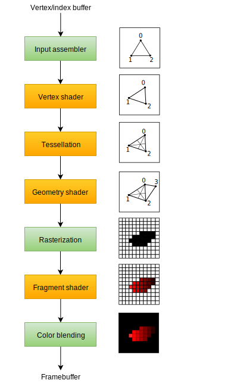
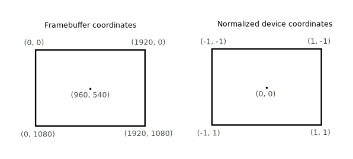

# Introduction to Vulkan Tutorial Notes
- Following Vulkan Tutorial at https://vulkan-tutorial.com/Introduction

- Notes
    - Any section where it's mostly implementation, you can skip and write:
    ```
    Implementation details (skip)
    ```
<br></br>
<br></br>

# Drawing a triangle

## Setup

### Base Code
- General Structure
    - This code includes the necessary headers and defines macros for a Vulkan program. The program is structured as a class with private members for Vulkan objects and functions to initialize them. 
    The main loop is used to render frames. 
    Resources are deallocated in the cleanup function. 
    If a fatal error occurs, a descriptive message is thrown as a std::runtime_error exception, which is caught in the main function and printed. One example of an error is the lack of support for a required extension.
- Resource Management
    - Vulkan objects need to be explicitly destroyed when no longer needed. While C++ offers automatic resource management options, the tutorial chooses explicit allocation and deallocation for better understanding of the API. 
    - After completing the tutorial, one can implement automatic resource management using C++ classes or custom deleters.
    - Vulkan objects are created and allocated using specific functions and destroyed using corresponding functions. The pAllocator parameter, which allows custom memory allocator callbacks, is ignored in the tutorial with a nullptr argument.
- Integrating GLFW
    - GLFW (Graphics Library Framework) is a portable open-source library that provides a simple API for creating and managing windows, handling user input, and managing OpenGL contexts. 
    - In the context of Vulkan, GLFW is commonly used as a utility library to handle window creation and management, input handling, and surface creation for Vulkan rendering applications.

<br></br>


### Instance
- Creating an instance
    - The very first thing you need to do is initialize the Vulkan library by creating an instance. 
    - The VkInstance instance is created by specifying various parameters and options during its creation. 
    - These parameters include application information, such as the application name and version, as well as the required extensions and validation layers.
    - Once the VkInstance is created, it serves as the entry point for interacting with the Vulkan API. 
    - It acts as a handle through which the application can access various Vulkan features and functionalities. The instance is used to create logical devices, manage resources, query device capabilities, and performs other Vulkan operations.
- Encountered VK_ERROR_INCOMPATIBLE_DRIVER
    - VK_ERROR_INCOMPATIBLE_DRIVER is a Vulkan error message indicating that the installed graphics driver on your system is not compatible with the Vulkan API version or does not meet the minimum requirements. 
    - To resolve the issue, you can try updating your graphics driver, ensuring your GPU supports Vulkan, checking for the required Vulkan API version, verifying operating system compatibility, and addressing any system configuration issues. 
- Checking for extension support
    - To check for extension support in Vulkan, you can use the vkEnumerateInstanceExtensionProperties function before creating an instance. This function retrieves a list of supported extensions and stores the details in an array of VkExtensionProperties. 
    - By providing a pointer to a variable, you can obtain the number of extensions available. While essential extensions like the window system interface can be required and checked for error code VK_ERROR_EXTENSION_NOT_PRESENT, optional functionality can be checked using this method.
- Cleaning up
    - The VkInstance should be destroyed only when the program is about to exit. 
    - In the cleanup function, the vkDestroyInstance function is used to destroy the instance. 
    - The function takes the instance as a parameter, and since the allocator callback is optional, nullptr is passed to it. 
    - It's important to clean up all other Vulkan resources created before destroying the instance.

<br></br>


### Validation layers
- What are validation layers?
    - The Vulkan API prioritizes minimal driver overhead, resulting in limited default error checking. Mistakes like incorrect enumerations or null pointers may cause crashes or undefined behavior. 
    - To address this, Vulkan offers optional validation layers. Validation layers are components that intercept Vulkan function calls to perform additional operations:
        1. Checking the values of parameters against the specification to detect misuse.
        2. Tracking creation and destruction of objects to find resource leaks.
        3. Checking thread safety by tracking threads that calls originate from.
        4. Logging every call and its parameters to the standard output.
        5. Tracing Vulkan calls for profiling and replaying.
- Using validation layers
    - Implementation details (skip)
- Message callback
    - The validation layers will print debug messages to the standard output by default, but we can also handle them ourselves by providing an explicit callback in our program. 
    - To set up a callback in the program to handle messages and the associated details, we have to set up a debug messenger with a callback using the VK_EXT_debug_utils extension.
- Debuggin instance creation and destruction
    - In addition to validation layers, Vulkan provides the Debug Utils Messenger extension (VK_EXT_debug_utils), which allows for more detailed debugging and logging capabilities. 
    - The vkCreateDebugUtilsMessengerEXT function is used to create a debug messenger object that receives debugging callbacks for various Vulkan events. This function requires a valid instance to have been created beforehand.
    - During instance destruction, it is necessary to properly clean up the debug messenger object using the vkDestroyDebugUtilsMessengerEXT function. This function takes the instance and the debug messenger object as parameters and ensures that all resources associated with the debug messenger are properly released.
- Testing
    - Implementation details (skip)
- Configuration
    - When working with validation layers in Vulkan, there are additional settings available beyond the flags provided in the VkDebugUtilsMessengerCreateInfoEXT structure. These settings allow for further customization of the behavior of the validation layers.
    - To access and configure these layer settings, you can navigate to the Vulkan SDK installation directory and locate the "Config" directory. Inside this directory, you will find a file named "vk_layer_settings.txt" that provides instructions on how to configure the layers.
    - To configure the layer settings for your specific application, you can copy the "vk_layer_settings.txt" file to the "Debug" and "Release" directories of your project. Then, follow the instructions provided in the file to modify the settings according to your desired behavior.
<br></br>


### Physical devices and queue families
- Selecting a physical device
    - To use Vulkan, you need to select a suitable graphics card, also known as a physical device. 
    - After initializing the Vulkan library with a VkInstance, you can query the available physical devices using vkEnumeratePhysicalDevices. Next, evaluate each device's properties and features to determine its suitability for your application. Choose the best device based on your requirements. 
    - Once selected, you can create a logical device using vkCreateDevice to interact with the chosen physical device.
- Base device suitability checks
    - To evaluate the suitability of a physical device in Vulkan, you can start by querying basic device properties using the vkGetPhysicalDeviceProperties function. 
    - This provides information such as the device name, type, and supported Vulkan version. These details help assess the device's compatibility and capabilities for your application. 
- Queue families
    - In Vulkan, operations are performed by submitting commands to queues, which originate from different queue families. Each queue family supports a specific subset of commands, such as compute or memory transfer operations. 
    - To determine the appropriate queue family for our desired commands, we implement a function called findQueueFamilies. This function queries the available queue family properties, evaluates their capabilities, and selects the queue families that support the required commands. 
    - By identifying the suitable queue families, we ensure efficient execution of operations in Vulkan. Multiple queue families may be needed for concurrent handling of different command types.
<br></br>


### Logical device and queues
- Introduction
    - In Vulkan, after selecting a physical device, the next step is to set up a logical device to interface with it. The process is similar to creating an instance and involves specifying desired features, extensions, and queue configurations. 
    - You can create multiple logical devices from the same physical device to meet varying requirements. 
    - The logical device serves as the communication channel between your application and the physical device, allowing you to execute Vulkan commands and access resources efficiently. 
- Specifying the queues to be created
    - When creating a logical device in Vulkan, you need to specify the queues to be created using the VkDeviceQueueCreateInfo structure. 
    - For a graphics queue, you set the queue family index to the desired queue family that supports graphics capabilities. 
    - Typically, only one queue is needed for graphics operations. The queueCount parameter is set to 1, and the pQueuePriorities parameter can be set to a single value of 1.0f. 
- Specifying used device features
    - The next information to specify is the set of device features that we'll be using. These are the features that we queried support for with vkGetPhysicalDeviceFeatures.
- Creating the logical device
    - To create a logical device in Vulkan, you need to fill in the VkDeviceCreateInfo structure. This structure holds various parameters that define the configuration and features of the logical device. 
    - Key fields to consider include sType, pNext, flags, queueCreateInfoCount, pQueueCreateInfos, enabledLayerCount, ppEnabledLayerNames, enabledExtensionCount, and ppEnabledExtensionNames.
    - Once the structure is filled, you can create the logical device using the vkCreateDevice function. The logical device connects your application to the selected physical device, enabling the execution of Vulkan commands and utilization of device capabilities.
- Retrieving queue handles
    - When creating a logical device in Vulkan, queues are automatically created along with the device. However, to interact with these queues and submit commands, you need to retrieve their handles. 
    - By adding a class member of type VkQueue, you can store a handle to the desired queue, such as a graphics queue. To retrieve the handle, use the vkGetDeviceQueue function, passing in the logical device, the queue family index, and the index within the queue family.
<br></br>


## Presentation

### Window surface
- Window surface creation
    - In Vulkan, to connect with the window system and present rendered images, Window System Integration (WSI) extensions like VK_KHR_surface are used. 
    - This extension exposes a VkSurfaceKHR object representing an abstract surface for image presentation. The surface is backed by the window created using GLFW. 
    - The VK_KHR_surface extension is automatically enabled as part of the required instance extensions returned by glfwGetRequiredInstanceExtensions. The surface creation should be done after instance creation and can influence physical device selection.
- Querying for presentation support
    - In Vulkan, querying for presentation support is necessary to determine if a device can present images to a created surface. 
    - Just because the Vulkan implementation supports window system integration doesn't guarantee that every device can do so. To check, we use the vkGetPhysicalDeviceSurfaceSupportKHR function to check if a queue family can present images. 
    - By finding a suitable queue family, you can create a logical device that supports both the necessary graphics operations and presenting images to the surface.
- Creating the presentation queue 
    - Creating the presentation queue in Vulkan involves modifying the logical device creation procedure to include the presentation queue and creating a member variable to hold the queue handle. 
    - The necessary queue families, such as the graphics and present queue families, are identified, and a set is used to store the unique queue families. 
    - Iterate over the set to create VkDeviceQueueCreateInfo structures for each queue family, specifying the queue family index, queue count (usually one), and queue priority. 
    - When creating the logical device, include the VkDeviceQueueCreateInfo structures along with other device creation parameters.
<br></br>


### Swap chain
- Checking for swap chain support
    - In Vulkan, the concept of a "default framebuffer" is not present. Instead, Vulkan requires the explicit creation of an infrastructure called a swap chain to manage the buffers used for rendering before they are presented on the screen. 
    - The swap chain acts as a queue of images waiting to be displayed. The application acquires an image from the swap chain to render to it and then returns it back to the queue. 
    - The specific behavior of the queue and the conditions for presenting an image depend on the swap chain configuration, but its main purpose is to synchronize the presentation of images with the screen's refresh rate.
    - Before creating a swap chain, it is necessary to check for swap chain support. Not all graphics cards are capable of directly presenting images to a screen, especially those designed for servers that lack display outputs. 
    - Additionally, since image presentation is closely tied to the window system and surfaces associated with windows, it is not part of the core Vulkan functionality. 
    - To use the swap chain, the application needs to enable the VK_KHR_swapchain device extension after verifying its support by querying for its availability.
- Enabling device extensions
    - To enable the VK_KHR_swapchain extension in Vulkan for working with the swap chain, you need to modify the logical device creation structure. 
    - Instead of setting createInfo.enabledExtensionCount to 0, you set it to the number of enabled extensions (in this case, the VK_KHR_swapchain extension). Additionally, createInfo.ppEnabledExtensionNames should be set to an array containing the names of the enabled extensions.
- Querying details of swap chain support
    - When working with Vulkan, it is not enough to simply check if a swap chain is available. There are three main properties that need to be checked before proceeding with swap chain creation:
        1. Basic surface capabilities
            - This includes information such as the minimum and maximum number of images in the swap chain and the minimum and maximum width and height of the images. 
            - These capabilities help determine the appropriate settings for the swap chain to ensure it can function correctly with the window surface.
        2. Surface formats
            - This property refers to the pixel format and color space of the images in the swap chain. Different platforms and systems may support different formats and color spaces. 
            - Querying the available surface formats allows the application to select the most suitable format for rendering and displaying images.
        3. Presentation modes
            - The presentation mode determines how the images in the swap chain are presented to the screen. Different modes may offer different synchronization and display behaviors.
- Choosing the right settings for the swap chain
    - It is crucial to choose the optimal settings for the swap chain. This involves determining the surface format (color depth), presentation mode (conditions for swapping images to the screen), and swap extent (resolution of images in the swap chain). 
    - By querying the available surface formats, presentation modes, and surface capabilities, you can select the most suitable options based on factors such as color depth, desired performance, synchronization, and window system constraints. 
- Creating the swap chain
    - The createSwapChain function is called after logical device creation in the initVulkan function. Within the createSwapChain function, the surface format, presentation mode, swap extent, and other relevant settings are determined. 
    - Finally, the swap chain is created using the vkCreateSwapchainKHR function, ensuring that the swap chain is properly configured for synchronized image presentation with the screen.
- Retrieving the swap chain images
    - To summarize, after creating the swap chain in Vulkan, the next step is to retrieve the handles of the VkImages within the swap chain. This can be done by calling vkGetSwapchainImagesKHR function. 
    - First, query the number of images in the swap chain to resize the container accordingly. Then, call vkGetSwapchainImagesKHR again to retrieve the handles and store them in a vector. These handles will be used for rendering operations. 
    - No explicit cleanup is needed for the swap chain images as they will be automatically cleaned up when the swap chain is destroyed.
<br></br>


### Image views
- In Vulkan, an image view is used to access the data stored in a VkImage object. It acts as a window or view into the image, specifying how to interpret and access the pixels. Creating a VkImageView is necessary to use VkImages in the render pipeline. 
- For the swap chain images, a basic image view is created for each image, allowing them to be used as color targets in rendering operations.
<br></br>


## Graphics Pipeline Basics

### Introduction

1. Input assembler
    - Collects raw vertex data from the buffers you specify and may also use an index buffer to repeat certain elements without having to duplicate the vertex data itself.
2. Vertex shader
    - Run for every vertex and generally applies transformations to turn vertex positions from model space to screen space. It also passes per-vertex data down the pipeline.
3. Tessellation shaders
    - Allows you to subdivide geometry based on certain rules to increase the mesh quality. This is often used to make surfaces like brick walls and staircases look less flat when they are nearby.
4. Geometry shader
    - Run on every primitive (triangle, line, point) and can discard it or output more primitives than the amount that came in.
5. Rasterization stage
    - Discretizes the primitives into fragments. These are the pixel elements that they fill on the framebuffer. 
    - Any fragments that fall outside the screen are discarded and the attributes outputted by the vertex shader are interpolated across the fragments.
    - Usually fragments that are behind other primitive fragments are also discarded here because of depth testing.
6. Fragment shader
    - Invoked for every fragment that survives and determines which framebuffer(s) the fragments are written to and with which color and depth values.
    - It can do this using the interpolated data from the vertex shader, which can include things like texture coordinates and normals for lighting.
7. Color blending
    - Applies operations to mix different fragments that map to the same pixel in the framebuffer.
    - Fragments can simply overwrite each other, add up or be mixed based upon transparency.
<br></br>

- Difference between fixed-function and programmable stages.
    - Stages with a green color are fixed-function stages. These stages allow you to tweak their operations using parameters, but the way they work is predefined.
    - Stages with an orange color on the other hand are programmable, meaning that you can upload your own code to the graphics card to apply exactly the operations you want.
        - This allows you to use fragment shaders, for example, to implement anything from texturing and lighting to ray tracers. These programs run on many GPU cores simultaneously to process many objects, like vertices and fragments in parallel.
<br></br>


### Shader modules
- Introduction
    - In Vulkan, shader code needs to be specified in a bytecode format called SPIR-V, unlike earlier APIs that used human-readable syntax like GLSL and HLSL. 
    - SPIR-V is designed to be used with Vulkan and OpenCL and offers advantages such as simplified compiler implementation and improved compatibility across different GPU vendors. 
    - Khronos provides a vendor-independent compiler that translates GLSL code to SPIR-V, ensuring compliance with the standard. Google's glslc.exe can also be used for this purpose and provides additional features. 
    - GLSL itself is a shading language with a C-style syntax, featuring global variables for input and output handling, built-in vector and matrix primitives, and functions for graphics programming operations.
- Vertex shader
    - The vertex shader in Vulkan processes individual vertices, taking attributes like position, color, normal, and texture coordinates as input. 
    - It calculates the final position in clip coordinates and determines the attributes to be passed on to the fragment shader, such as color and texture coordinates. These values are then interpolated by the rasterizer to create a smooth gradient across the fragments.
    - Clip coordinates are four-dimensional vectors generated by the vertex shader. These coordinates are transformed into normalized device coordinates by dividing the vector by its last component. 
    - Normalized device coordinates are homogeneous coordinates that map the framebuffer to a coordinate system ranging from -1 to 1 in both dimensions. Additionally, the Z coordinate now ranges from 0 to 1.

- Fragment shader
    - The triangle that is formed by the positions from the vertex shader fills an area on the screen with fragments. The fragment shader is invoked on these fragments to produce a color and depth for the framebuffer (or framebuffers).
- Per-vertex colors
    - Implementation details (skip)
- Compiling the shaders
    - In Vulkan, to compile shaders, you need to create a "shaders" directory in your project's root directory. Inside this directory, you store the vertex shader in a file called "shader.vert" and the fragment shader in a file called "shader.frag".
- Loading a shader
    - In Vulkan, after compiling shaders into SPIR-V bytecode, they need to be loaded into the program for use in the graphics pipeline. 
    - To simplify this process, a helper function can be implemented to load the binary data from the shader files. This function reads the contents of the shader files, retrieves the binary data, and stores it in a suitable data structure.
- Creating shader modules
    - In Vulkan, shader code needs to be wrapped in a VkShaderModule object before it can be used in the graphics pipeline.
    - This shader module can be utilized when defining the shader stages in the graphics pipeline setup.
- Shader stage creation
    - In Vulkan, shaders are assigned to specific pipeline stages using VkPipelineShaderStageCreateInfo structures during the creation of the graphics pipeline. These structures contain information about the shader stage type, shader module, entry point function name, and specialization data.
    - To assign the vertex shader, the VkPipelineShaderStageCreateInfo structure is filled with the appropriate stage type (VK_SHADER_STAGE_VERTEX_BIT), the VkShaderModule object containing the shader code.
<br></br>


### Fixed functions
- Dynamic state
- Vertex input
- Input Assembly
- Viewports and scissors
- Rasterizer
- Multisampling
- Depth and stencil testing
- Color blending
- Pipeline layout
- Conclusion

<br></br>


### Render pass
- Setup
- Attachment description
- Subpasses and attachment references
- Render pass

<br></br>


### Conclusion

<br></br>


## Drawing

<br></br>


### Framebuffers

<br></br>


### Command buffers
- Command pools
- Command buffer allocation
- Command buffer recording
- Starting a render pass
- Basic drawing commands
- Finishing up

<br></br>


### Rendering and presentation
- Outline of a frame
- Synchronization
- Creating the synchronization objects
- Waiting for the previous frame
- Acquiring an image from the swap chain
- Recording the command buffer
- Submitting the command buffer
- Subpass dependencies
- Presentation
- Conclusion

<br></br>


### Frames in flight

<br></br>


## Swap chain recreation
- Introduction
- Recreating the swap chain
- Suboptimal or out-of-date swap chain
- Fixing a deadlock
- Handling resizes explicitly
- Handling minimization
